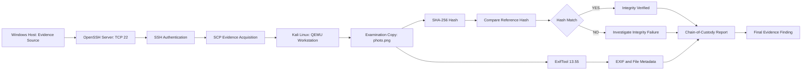

# Project Architecture

## Implemented Architecture

The following diagram shows the actual implemented workflow: Windows is the evidence source, Kali Linux running in QEMU is the forensic workstation, SCP is used for acquisition, SHA-256 is used for integrity verification, and ExifTool is used for metadata examination.

## Step-by-Step Flow

1. **Evidence source** – `photo.png` was selected from the Windows host.
2. **Remote access** – OpenSSH Server was configured on Windows and verified as running.
3. **Network validation** – TCP port 22 was tested from Kali; the working Windows address was `192.168.0.102`.
4. **SSH connection** – Kali connected to the Windows account using SSH.
5. **Evidence acquisition** – The evidence file was copied from Windows to Kali using SCP.
6. **Integrity baseline** – SHA-256 was calculated for the evidence on Windows using `certutil`.
7. **Forensic copy verification** – SHA-256 was calculated again for the Kali examination copy using `sha256sum`.
8. **Metadata examination** – ExifTool 13.55 was used to inspect file and image metadata.
9. **Finding** – The SHA-256 values matched, so the examination copy was recorded as **VERIFIED – HASH MATCHED**.
10. **Documentation** – Hash, metadata, evidence path, findings, and processing time were recorded in the chain-of-custody report.

## Tools Used

Only the required tools were used for this implementation:

- **OpenSSH / SCP** – secure remote access and evidence transfer
- **SHA-256 (`sha256sum` / Windows `certutil`)** – integrity verification
- **ExifTool** – metadata examination

## Environment

| Component | Role |
|---|---|
| Windows host | Evidence source and OpenSSH server |
| Kali Linux | Forensic examination workstation |
| QEMU | Runs the Kali forensic environment |
| `photo.png` | Examination evidence |

## Integrity Result

SHA-256 recorded during the implementation:

`2ef665d31b00da877382e8624149ae7fc4cd8f8c907c5f6e3de8211f5094bda3`

Result: **VERIFIED – HASH MATCHED**.
